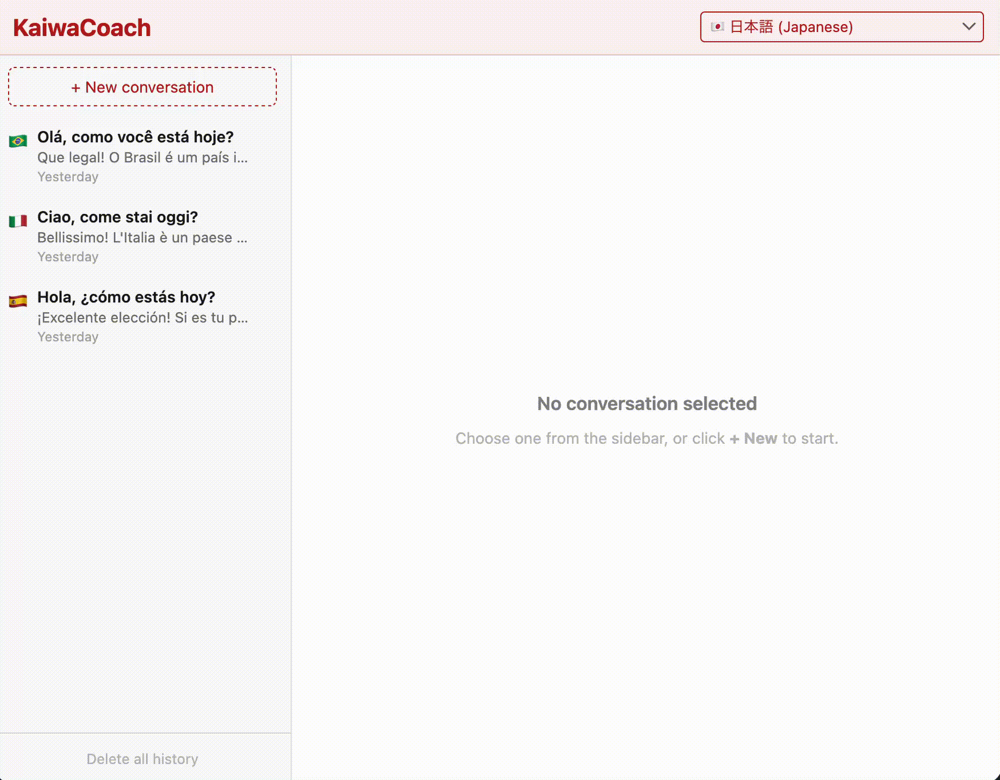
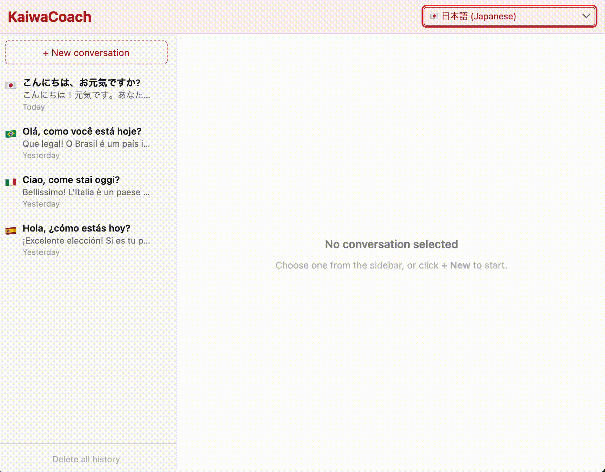

<p align="center">
  
</p>

# KaiwaCoach

[](https://github.com/a-anderson/kaiwa-coach/actions/workflows/tests.yaml)
[](https://opensource.org/licenses/MIT)


KaiwaCoach is an offline-first language coaching app for Apple Silicon macOS.  
It supports text and microphone turns, structured correction feedback, and TTS playback, with clear model orchestration and persistence boundaries.

## Example Usage

### Audio Input (Japanese)

<p align="center">
  
</p>

### Text Input (French)

<p align="center">
  
</p>

## What It Does

- Runs a local conversational loop with:
    - user text/audio input
    - assistant reply generation
    - optional correction pipeline:
        - error detection
        - corrected sentence
        - native rewrite
        - explanation
    - TTS synthesis of assistant reply
- Persists conversations and supports:
    - list, load, resume
    - delete one conversation
    - delete all history
- Enforces JSON schema on LLM role outputs with bounded repair behaviour
- Applies Japanese TTS normalisation with invariant checks and fallback behaviour

## Architecture

### High-level flow

1. UI captures a user turn (text or audio).
2. Orchestrator persists inputs, runs the turn pipeline, and records timings.
3. LLM role calls are prompt-rendered and schema-validated.
4. TTS output is synthesised and returned to UI.
5. Conversation and turn artefacts are stored via the storage layer.

### Module boundaries

- [src/kaiwacoach/ui/](src/kaiwacoach/ui/)
    - Gradio layout and callback wiring
- [src/kaiwacoach/orchestrator.py](src/kaiwacoach/orchestrator.py)
    - turn lifecycle, sequencing, and timing
- [src/kaiwacoach/models/](src/kaiwacoach/models/)
    - typed wrappers for ASR/LLM/TTS and JSON enforcement
- [src/kaiwacoach/textnorm/](src/kaiwacoach/textnorm/)
    - normalisation and language invariants
- [src/kaiwacoach/storage/](src/kaiwacoach/storage/)
    - SQLite writer queue and media storage handling

## Engineering Notes

- LLM calls are role-based with explicit token caps.
- Role outputs are schema-validated with one repair attempt.
- Turn processing uses deterministic defaults and explicit timing logs.
- Before TTS, Japanese text is verified to ensure it was not accidentally altered.

## Tech Stack

- Python 3.11
- Gradio
- SQLite
- Poetry
- Local ASR/LLM/TTS model wrappers in [src/kaiwacoach/models/](src/kaiwacoach/models/)

## Platform and Scope

- Primary target: **macOS Apple Silicon**
- Runtime target: **offline-first**
- Supported session languages:
    - `ja` - Japanese
    - `fr` - French
    - `en` - English
    - `es` - Spanish
    - `it` - Italian
    - `pt-br` - Portuguese (Brazil)

## Getting Started

### Prerequisites

- macOS Apple Silicon
- Python 3.11
- Poetry

### Install

```bash
poetry install
poetry run bash scripts/setup_macos.sh
```

For test execution (installs the `dev` dependency group, including `pytest`):

```bash
poetry install --with dev
```

### Run

```bash
poetry run python -m kaiwacoach.app
```

## Configuration

Configuration is loaded from:

1. defaults
2. optional config file
3. environment overrides

For full details (keys, env vars, and load behaviour), see the [Configuration guide](docs/configuration.md).

Use [config.example.yaml](config.example.yaml) as the file-based template.

## Usage

### Text turn

1. Select language.
2. Enter text and send.
3. Review assistant response and optional correction outputs.
4. Play synthesised audio.

### Audio turn

1. Record input with microphone.
2. Send audio.
3. Review ASR-derived user text, assistant response, and optional corrections.
4. Play synthesised audio.

### Conversation persistence

- Refresh and load past conversations from the side panel.
- Resume prior conversation context in UI.
- Delete one conversation or all history.

## Testing

Ensure dev dependencies are installed first:

```bash
poetry install --with dev
```

Run all tests:

```bash
poetry run pytest -q
```

Run non-slow tests:

```bash
poetry run pytest -q -m "not slow"
```

Run slow/integration tests:

```bash
poetry run pytest -q -m slow
```

## Smoke Scripts

These scripts verify that local models are installed correctly, can be loaded, and can run one basic inference path.

- [scripts/asr_smoke.py](scripts/asr_smoke.py)
    - ASR model load and short transcription
- [scripts/tts_smoke.py](scripts/tts_smoke.py)
    - TTS model load and synthesis from sample text
- [scripts/llm_smoke.py](scripts/llm_smoke.py)
    - LLM model load and sample generation

Run:

```bash
poetry run python scripts/asr_smoke.py --language ja --seconds 6
poetry run python scripts/tts_smoke.py --text "こんにちは。元気ですか？" --lang_code j --voice jf_alpha
poetry run python scripts/llm_smoke.py --language ja
```

## Data and Persistence

- Conversation and turn records are persisted in SQLite.
- Audio artefacts are persisted via the storage layer.
- Conversation metadata includes language/model context for resume behaviour.

## Performance and Reliability

- Turn stage timings are logged (ASR, LLM, corrections, TTS, total).
- Role token caps and context limits are configurable for latency control.
- Schema enforcement prevents invalid role outputs from silently propagating.

## Evaluation

The project currently reports system-level evidence in three areas:

1. **Automated reliability checks**
2. **Schema/repair robustness checks**
3. **Per-stage latency instrumentation**

### Automated reliability checks

- CI runs non-slow tests on each push and pull request:
    - `poetry run pytest -q -m "not slow"`
- Full local suite (including slow tests) is available with:
    - `poetry run pytest -q`

Latest full local snapshot:

- `156 passed`

### Schema and repair robustness

LLM role outputs are schema-validated, with one repair attempt on invalid output.  
These paths are covered in tests under:

- [tests/test_json_enforcement.py](tests/test_json_enforcement.py)
- [tests/test_orchestrator_text_flow.py](tests/test_orchestrator_text_flow.py)

### Latency instrumentation

Turn processing logs stage timings for:

- ASR
- LLM generation
- corrections (detect/correct/native/explain)
- TTS
- total turn time

Instrumentation lives in:

- [src/kaiwacoach/orchestrator.py](src/kaiwacoach/orchestrator.py)

## Limitations

- Gradio audio recorder internals expose limited stable theming hooks; some recorder visuals remain framework-controlled.
- Current scope is local Apple Silicon execution.

## Roadmap

Current implementation status and post-MVP work are tracked in:

- [docs/KaiwaCoach_Implementation_Checklist_v1.1.md](docs/KaiwaCoach_Implementation_Checklist_v1.1.md)

## Contributing

- Keep prompts in [src/kaiwacoach/prompts/](src/kaiwacoach/prompts/)
- Preserve module boundaries (UI/orchestrator/models/storage/textnorm)
- Add or update tests with behaviour changes
- Prefer small, reviewable pull requests with clear scope

## Licence

This project is licensed under the MIT Licence.  
See [LICENSE](LICENSE).

## Acknowledgements

KaiwaCoach is built on open-source tooling and local model ecosystems, including Gradio, SQLite, and local model runtimes used by this project.
