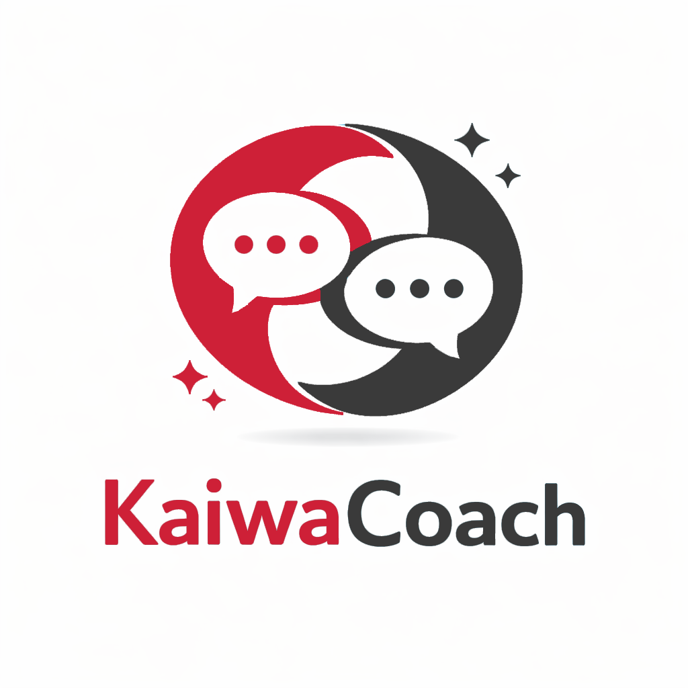

<p align="center">
  
</p>

<p align="center">
  <strong>KaiwaCoach</strong><br/>
  Local-first conversational language coaching with deterministic, schema-validated LLM pipelines.
</p>

[](https://github.com/a-anderson/kaiwa-coach/actions/workflows/tests.yaml)
[](https://opensource.org/licenses/MIT)


# KaiwaCoach

KaiwaCoach is an offline-first language coaching app built for Apple Silicon macOS.  
It supports text and microphone turns, structured correction feedback, and TTS playback while keeping model orchestration, persistence, and normalisation logic explicit and testable.

This project is designed to showcase both:

- **Software engineering quality**: modular architecture, typed contracts, deterministic defaults, persistence, and broad automated tests.
- **Applied AI/data engineering practice**: role-based LLM prompting, schema enforcement with one-shot repair, latency instrumentation, and language-specific normalisation safeguards.

## Demo

- App logo: [assets/logo/kaiwacoach_logo.png](assets/logo/kaiwacoach_logo.png)
- UI demo assets can be added under [assets/](assets/) (recommended for public profile polish):
    - full UI screenshot
    - short text-turn GIF
    - short audio-turn GIF

## What It Does

- Runs a local conversational loop with:
    - user text/audio input
    - assistant reply generation
    - optional correction pipeline:
        - error detection
        - corrected sentence
        - native rewrite
        - explanation
    - TTS synthesis of assistant reply
- Persists conversations and supports:
    - list, load, resume
    - delete one conversation
    - delete all history
- Enforces JSON schema on LLM role outputs with bounded repair behaviour.
- Applies Japanese TTS normalisation with invariant checks/fallback behaviour.

## Why This Is Technically Interesting

KaiwaCoach is not just a chat UI over a model. It solves several practical reliability problems:

- **Structured outputs from generative models**  
  Each LLM role is schema-constrained and validated before downstream use.

- **Deterministic multi-role inference in one app**  
  Conversation, correction, explanation, and JP TTS normalisation are separate logical roles with explicit token caps.

- **Normalisation with safety invariants**  
  Japanese normalisation includes invariant validation and fallback to avoid silent corruption.

- **Real persistence + session lifecycle**  
  Conversation history is resumable across app restarts with metadata and UI synchronisation.

## Architecture

### High-level flow

1. UI captures user turn (text or audio).
2. Orchestrator persists input, runs generation pipeline, and logs timings.
3. LLM roles are invoked with prompt templates and schema validation.
4. TTS output is synthesised and surfaced to UI.
5. Conversation/turn artifacts are stored in SQLite + storage layer.

### Module boundaries

- [src/kaiwacoach/ui/](src/kaiwacoach/ui/)
    - Gradio UI composition and callback wiring only.
- [src/kaiwacoach/orchestrator.py](src/kaiwacoach/orchestrator.py)
    - Turn lifecycle, orchestration, persistence calls, timing logs.
- [src/kaiwacoach/models/](src/kaiwacoach/models/)
    - Typed wrappers for ASR/LLM/TTS and JSON enforcement.
- [src/kaiwacoach/textnorm/](src/kaiwacoach/textnorm/)
    - Language normalisation and invariants.
- [src/kaiwacoach/storage/](src/kaiwacoach/storage/)
    - SQLite writer queue + media blob handling.

## Tech Stack

- Python 3.11
- Gradio (UI)
- SQLite (persistence)
- Poetry (environment/run workflow)
- Local ASR/LLM/TTS model wrappers ([src/kaiwacoach/models/](src/kaiwacoach/models/))

## Platform and Scope

- Primary target: **macOS Apple Silicon**
- Runtime target: **offline-first**
- Supported session languages:
    - `ja` - Japanese
    - `fr` - French
    - `en` - English
    - `es` - Spanish
    - `it` - Italian
    - `pt-br` - Portuguese (Brazil)

## Engineering Decisions and Trade-offs

- **Role-based LLM contracts over free-form text**
    - Pro: safer downstream behaviour and testability.
    - Trade-off: tighter prompt/schema maintenance.
- **Single orchestrator-owned pipeline**
    - Pro: explicit sequencing and timing observability.
    - Trade-off: orchestration file can grow; periodic refactoring required.
- **Fixed waveform theming for MVP stability**
    - Pro: predictable behaviour across Gradio internals.
    - Trade-off: reduced dynamic theme control for recorder internals.

## Getting Started

### Prerequisites

- macOS Apple Silicon
- Python 3.11
- Poetry

### Install

```bash
poetry install
poetry run bash scripts/setup_macos.sh
```

For test execution (installs the `dev` dependency group, including `pytest`):

```bash
poetry install --with dev
```

### Run

```bash
poetry run python -m kaiwacoach.app
```

## Configuration

KaiwaCoach configuration is loaded from:

1. defaults
2. optional config file
3. environment overrides

For full details (all environment variables, config keys, and load behaviour), see:

- [Configuration guide](docs/configuration.md)

Use [config.example.yaml](config.example.yaml) as the file-based template.

## Usage

### Text turn

1. Select language.
2. Enter text and send.
3. Review assistant response and optional correction outputs.
4. Play synthesised audio.

### Audio turn

1. Record input with microphone.
2. Send audio.
3. Review ASR-derived user text, assistant response, and optional corrections.
4. Play synthesised audio.

### Conversation persistence

- Refresh and load past conversations from the side panel.
- Resume prior conversation context in UI.
- Delete one conversation or all history.

## Testing

Ensure the dev dependencies are installed first:

```bash
poetry install --with dev
```

Run all tests:

```bash
poetry run pytest -q
```

Run non-slow tests:

```bash
poetry run pytest -q -m "not slow"
```

Run slow/integration tests:

```bash
poetry run pytest -q -m slow
```

## Smoke Scripts

Verify local models are installed correctly, can be loaded, and can run end-to-end for one basic inference path each.

What each script covers:

- [scripts/smoke_asr.py](scripts/smoke_asr.py)
    - Verifies the ASR model is installed, loads, and can transcribe a short sample.
- [scripts/smoke_tts.py](scripts/smoke_tts.py)
    - Verifies the TTS model is installed, loads, and can synthesise audio from sample text.
- [scripts/smoke_llm.py](scripts/smoke_llm.py)
    - Verifies the LLM model is installed, loads, and can generate a response for a sample prompt.

How to run:

```bash
poetry run python scripts/smoke_asr.py --language ja --seconds 6
poetry run python scripts/smoke_tts.py --text "こんにちは。元気ですか？" --lang_code j --voice jf_alpha
poetry run python scripts/smoke_llm.py --language ja
```

## Data and Persistence

- Conversation and turn records are persisted in SQLite.
- Audio artifacts are persisted via storage layer references.
- Conversation metadata includes language/model context needed for resume behaviour.

## Performance and Reliability Notes

- Turn stage timings are logged (ASR, LLM, corrections, TTS, total).
- Role-level token caps and context limits are configurable for latency control.
- JSON enforcement prevents invalid role outputs from silently propagating.

## Limitations

- Gradio audio recorder internals expose limited stable theming hooks; some recorder visuals can remain framework-controlled.
- Project scope is currently local Apple Silicon execution.

## Roadmap

See the implementation checklist for current status and post-MVP items:

- [docs/KaiwaCoach_Implementation_Checklist_v1.1.md](docs/KaiwaCoach_Implementation_Checklist_v1.1.md)

## Contributing

For local contributions:

- Keep prompts in [src/kaiwacoach/prompts/](src/kaiwacoach/prompts/)
- Preserve module boundaries (UI/orchestrator/models/storage/textnorm)
- Add or update tests with behaviour changes
- Prefer small, reviewable pull requests with clear scope

## Licence

This project is licensed under the MIT Licence.  
See [LICENSE](LICENSE).

## Acknowledgements

KaiwaCoach is built on open-source tooling and local model ecosystems, including Gradio, SQLite, and local model runtimes used by this project.
