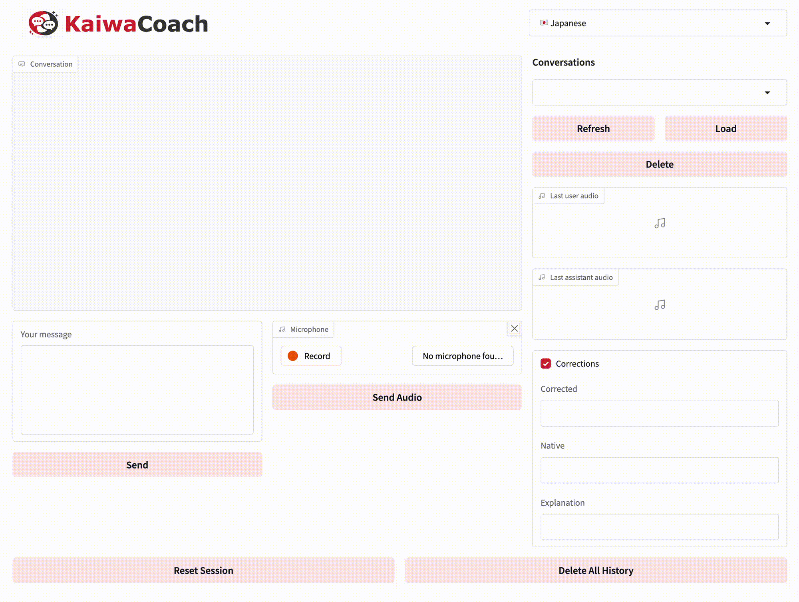
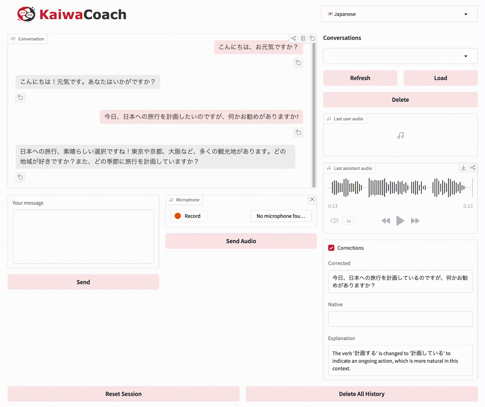
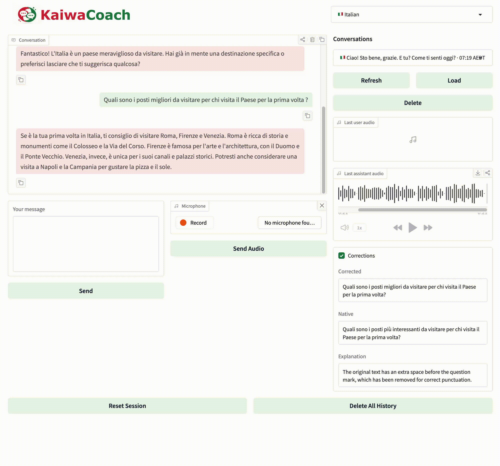
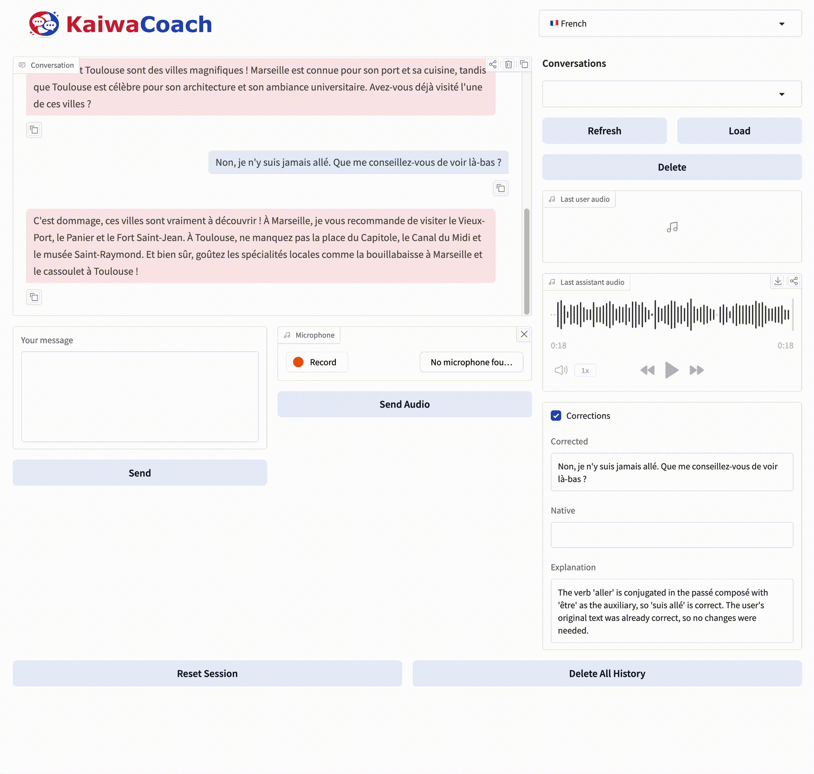

# KaiwaCoach Feature Demos

## Demo Index

| Feature                    | Demo File                                   | Notes                                                                                  |
| -------------------------- | ------------------------------------------- | -------------------------------------------------------------------------------------- |
| Text input turn flow       | `assets/demos/text_input.gif`               | User submits text, receives assistant reply, TTS output, and corrections flow.         |
| Audio input turn flow      | `assets/demos/audio_input.gif`              | User records/submits audio, ASR transcribes, assistant responds, and audio plays back. |
| Load conversation          | `assets/demos/load_conversation.gif`        | User loads a prior conversation and resumes context.                                   |
| Reset session              | `assets/demos/reset_session.gif`            | Clears active session state while preserving stored history.                           |
| Delete single conversation | `assets/demos/delete_conversation.gif`      | Removes selected conversation with confirmation UI.                                    |
| Delete all conversations   | `assets/demos/delete_all_conversations.gif` | Bulk-delete flow with destructive-action confirmation.                                 |

## Demo Gallery

### Text Input Turn Flow

  

### Audio Input Turn Flow

  

### Load Conversation

  

### Reset Session

  

### Delete Single Conversation

  

### Delete All Conversations

  

