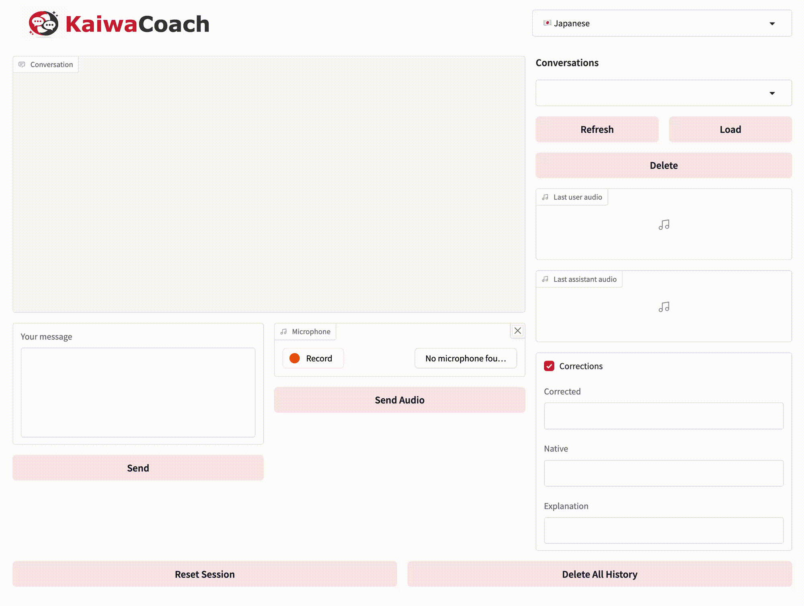
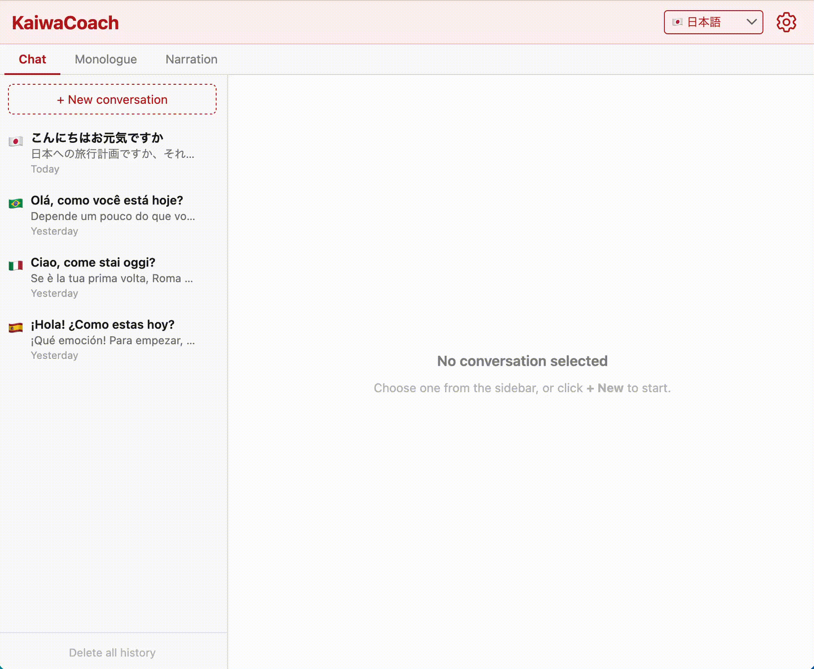

# KaiwaCoach Feature Demos

## Demo Index

| Feature                                    | Demo File                               | Notes                                             |
| ------------------------------------------ | --------------------------------------- | ------------------------------------------------- |
| Chat turn flow                             | `assets/demos/chat_turn.gif`            | Submit a text message and receive an assistant reply with TTS playback. The corrections card shows errors, a corrected form, native reformulation, and an explanation. The conversation summary analyses top error patterns, priority focus areas, and overall conversation notes |
| Load conversations, regen audio, shadowing | `assets/demos/load_conversation.gif`    | Load a saved conversation, regenerate all assistant audio, then use shadowing mode to listen and record alongside the assistant. |
| Delete conversation(s)                     | `assets/demos/delete_conversations.gif` | Delete a single conversation, then bulk-delete the entire conversation history. |
| Monologue mode                             | `assets/demos/monologue.gif`            | Record a monologue and show corrections and advice |
| Narration mode                             | `assets/demos/narration.gif`            | Convert input text to downloadable audio using text-to-speech |

## Demo Gallery

### Chat Turn Flow, Corrections & Conversation Summary

  

### Load Conversations, Regenerate Audio, and Shadowing

  

### Delete Conversation(s)

  

### Monologue Mode

  

### Narration Mode

  

