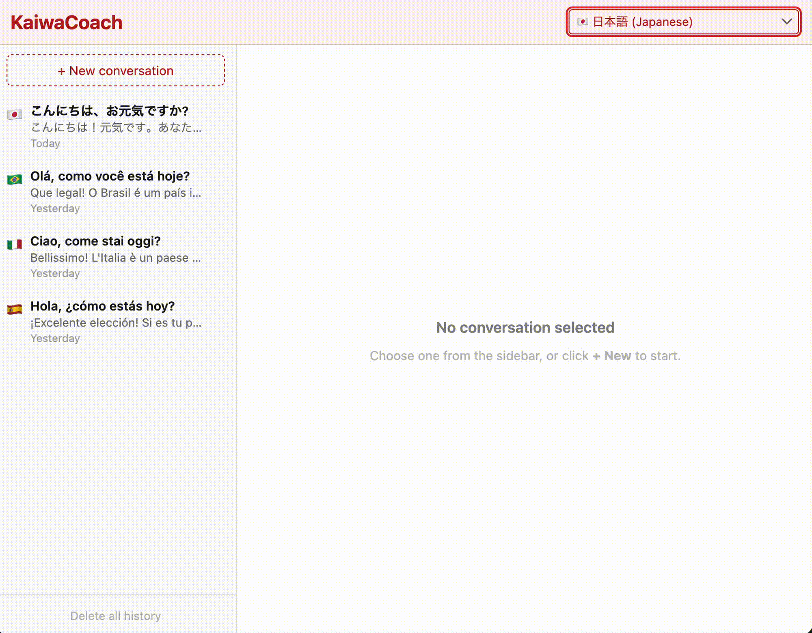
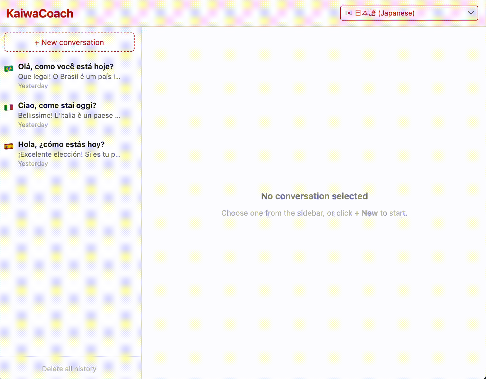
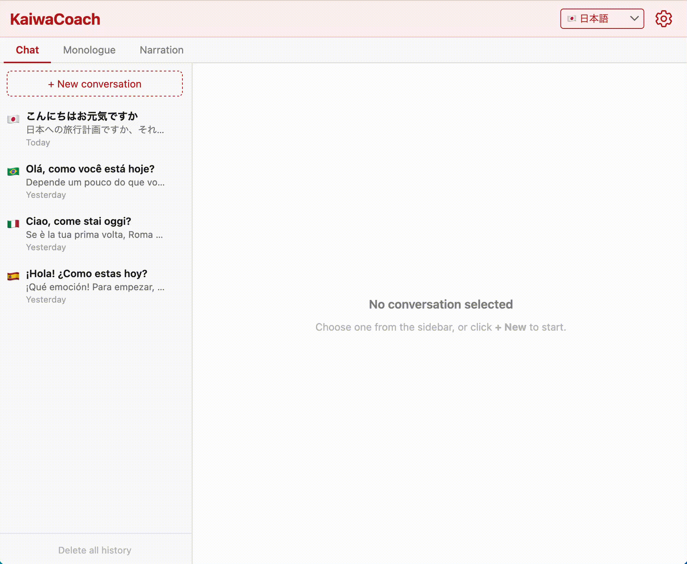

# KaiwaCoach Feature Demos

## Demo Index

| Feature                                   | Demo File                                    | Notes                                                                                                                           |
| ----------------------------------------- | -------------------------------------------- | ------------------------------------------------------------------------------------------------------------------------------- |
| Text input turn flow                      | `assets/demos/text_input.gif`                | Submit a text message and receive an assistant reply with TTS playback. The corrections card shows errors, a corrected form, native reformulation, and an explanation. |
| Audio input turn flow                     | `assets/demos/audio_input.gif`               | Record and submit audio, watch ASR transcribe the input, and get an assistant reply with TTS playback and a corrections card.   |
| Load conversations, regen audio, shadowing | `assets/demos/load_conversations.gif`        | Load a saved conversation, regenerate all assistant audio, then use shadowing mode to listen and record alongside the assistant. |
| Delete conversation(s)                    | `assets/demos/delete_conversations.gif`      | Delete a single conversation, then bulk-delete the entire conversation history.                                                 |

## Demo Gallery

### Text Input Turn Flow

  

### Audio Input Turn Flow

  

### Load Conversations, Regenerate Audio, and Shadowing

  

### Delete Conversation(s)

  

